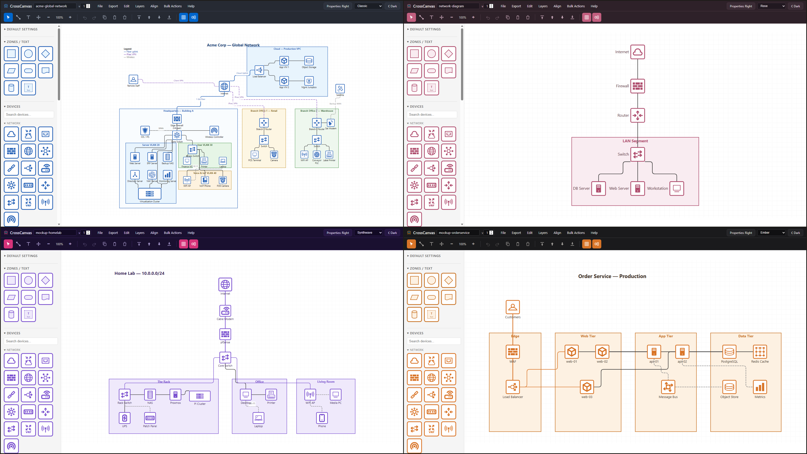

# CrossCanvas - Diagram Editor

> A lightweight, self-hostable network diagram editor - no build step, no
> backend, no network calls. Its diagrams become live monitoring dashboards
> in [PingCanvas](https://github.com/RootSwitch/PingCanvas), which can also
> carry live SNMP readings from [SNMPCanvas](https://github.com/RootSwitch/SNMPCanvas).
> [AlertCanvas](https://github.com/RootSwitch/AlertCanvas) turns those
> readings into raise/clear notifications,
> [SyslogCanvas](https://github.com/RootSwitch/SyslogCanvas) collects
> syslog and SNMP traps from the same gear, and
> [LaunchCanvas](https://github.com/RootSwitch/LaunchCanvas) is the suite's
> front door - one login for every app, and the place to start.

**Install the whole suite in one command:** the [canvas-suite](https://github.com/RootSwitch/canvas-suite) repo is the family's landing page, with one-shot install scripts for the full six-app stack or a Pi-class PingCanvas + AlertCanvas pair.

**[Try the editor live in your browser](https://rootswitch.github.io/CrossCanvas/?sample=complex&fit=1)** - no install, no sign-up, nothing leaves your machine.

CrossCanvas is a lightweight, locally hostable network diagram editor that
supports a variety of diagram formats (`.vsdx`, `.gliffy`, `.drawio`) and can
import a variety of common client & device inventory formats to make
diagramming an existing environment easier. It is designed for simplicity and
usability first, but also supports expandability for those who want their own
custom stencils and images. It is security-focused with no external
dependencies or network calls, leveraging the browser's localStorage and
saving/loading directly to the local filesystem. Diagrams it creates can then
be directly converted to basic NOC monitoring dashboards through its sister
application, **PingCanvas**.

For a step-by-step walkthrough, see **[USER_GUIDE.md](USER_GUIDE.md)**. For the
full change history, see `CHANGELOG.md`; for design rationale, `NOTES.md`.

---

## Highlights

- **Drag-and-drop diagramming** - devices, zones, connections, text, and images
  on a snapping grid, with multi-select, grouping, alignment guides, and undo/redo.
- **A bundled stencil set** - 55 icons across categorized groups (network,
  endpoints, servers, security, OT/IoT, telecom, and more) with app-drawn frames
  that recolor cleanly; import your own SVG/PNG icons or share a whole device
  library.
- **Import a variety of diagram formats** - Visio (`.vsdx`), Gliffy
  (`.gliffy`), and draw.io (`.drawio`) open with high fidelity, and
  **Import & Merge** stitches multiple diagrams, in any mix of formats,
  together onto one canvas.
- **Inventory import** - turn client & device inventory exports (Cisco
  Catalyst Center, ISE, NetBox, DNS/DHCP, `arp -a`) into a laid-out starting
  diagram, grouped into zones by location.
- **Smart connections** - straight, rounded, or orthogonal routing; draggable
  bends and waypoints; arrowheads, dash styles, labels, and inline annotations;
  endpoints that stay glued to devices as you move them.
- **Rich text** - multi-line labels with per-character bold, italic, and color;
  curated font families; full horizontal/vertical alignment.
- **30 color themes + dark mode** - recolor the whole app chrome and the default
  object palette in a click; dark mode is surface-aware so labels stay legible.
  Alongside the **Classic** default is a spread of themes including a material
  family inspired by the canvas name (Canvas, Blueprint, Ink, Gesso).
- **Per-device data fields** - attach Hostname, IP, Serial, Asset Tag, and more
  to any device; they travel with the file and export to CSV.
- **Built-in Help** - a Quick Start, the full User Guide, a keyboard-shortcut
  reference (`?`), and an About box, embedded so they travel with the hosted app.

## Import & export

| Direction | Formats |
|-----------|---------|
| **Import** | CrossCanvas (`.xcanvas`), Gliffy (`.gliffy`), Visio (`.vsdx` / `.vsdm`), draw.io (`.drawio`), Inventory (CSV / lease files / text dumps) |
| **Export** | PNG (incl. transparent), JPEG, PDF, SVG, draw.io (`.drawio`), CSV (data) |

- **Gliffy, Visio, and draw.io import** are high-fidelity and fully in-browser -
  device icons map to the bundled set, zones/colors/routes are preserved,
  embedded images are carried over, and multi-page files prompt for a page.
  draw.io import reads both compressed and uncompressed saves. On stencil
  swaps, **your own stencils take priority** over the bundled set - name a
  Device Library import "Cisco Switch" and every imported switch uses it.
- **draw.io export** opens directly in diagrams.net (which can re-export to
  Visio, bridging that format too) - and re-importing your own export
  round-trips icons, colors, and Device Details. For sensitive diagrams, the
  open-source **draw.io Desktop** app does the same Visio conversion entirely
  offline - no diagram ever touches a website.
- **Import & Merge** combines diagrams onto one canvas - open a Visio site
  plan, merge in a Gliffy rack and a native board, and marry them into a
  single diagram (fresh ids, one undo per merge).
- **Inventory import** turns a device list into a laid-out
  starting diagram, grouped into zones by a `Location` path. Cisco Catalyst
  Center, ISE, and **NetBox** exports are auto-detected and mapped with no
  cleanup (NetBox's Site / Location / Rack hierarchy imports as nested
  zones); Windows DNS/DHCP, Kea and dnsmasq leases, `arp -a`, and nmap
  output work too.
- **Raster exports scale** - Image Scale 1× / 2× / 4× for print- and
  video-sharp PNG/JPEG/PDF; **Ctrl+F** finds any device on a big board by
  label, hostname, or IP.
- **Generating diagrams with an AI agent?**
  [docs/agent-guide.md](docs/agent-guide.md) is a single self-contained file
  to hand Claude Code, Cline, or a local model - the CSV and `.xcanvas`
  formats, stencil names, and layout conventions, with no need to read the
  app source.

## Quick start

1. Get the files: clone the repo, or **Code → Download ZIP** and extract it.
2. Open `index.html` in a browser (or host the folder - see below).
3. Drag a stencil from the left palette onto the canvas.
4. Draw a connection by dragging from one device's edge to another.
5. **File → Save** writes a `.xcanvas` file; **File → Open / Import Diagram** or
   **Open Recent** loads one back. **Export** produces images, PDFs, or
   interchange formats.

Try **File → Load Sample** or **Load Complex Sample** to see a finished diagram.

## Privacy

CrossCanvas makes **zero outbound network requests** - no fonts, CDNs, telemetry, or
uploads. Diagrams never leave the machine unless you export or share a file
yourself. And if you'd rather not use someone's hosted copy at all,
**Help → Download Offline Copy** zips the app's own files (assembled right in
your browser) - unzip anywhere and open `index.html` to run it entirely from
your machine. Imported images are gated to inert `data:` URIs, and untrusted values
are escaped on every export path.

## Hosting

The app is a static site with no build step - the publish directory is the
repo root, and any static host works:

- **Local / production (IIS, nginx, or Apache)** - serve the folder over
  HTTPS. Intended for sensitive diagrams on trusted devices / network
  segments. The included `web.config` gives IIS a strict CSP (the app makes
  no outbound requests, so it costs nothing), plus the MIME mappings -
  including `.xcanvas`, so the `?board=` URL parameter works. Other hosts:
  replicate those headers in your host's config.
- **Netlify or similar (non-sensitive testing/demos)** - drag-and-drop the
  folder at app.netlify.com/drop, or connect the Git repo with build command
  empty and publish directory `.`. Add the same headers via your host's
  config, and consider marking a test site `noindex`.

## Project layout

| File | Purpose |
|------|---------|
| `index.html` | App shell and markup |
| `app.js` | All application logic (single IIFE) |
| `style.css` | Styling and themes |
| `devices.js` | The 55 bundled base stencils |
| `customdevices.js` | Optional site/team stencil layer (not tracked) |
| `web.config` | IIS hosting config (security headers + MIME types); other hosts ignore it |

## Why one file?

`app.js` is ~15,000 lines in a single IIFE, and that's a design decision, not
an accident:

- **Auditability without tooling.** You can verify everything this app does -
  every network call it doesn't make - by reading the files you deploy. No
  bundle to reverse, no `node_modules` to trust, no build output that differs
  from the source. For the sensitive-diagram use case, *the source is the
  artifact*.
- **Deployment is simplified.** Hosting CrossCanvas anywhere - IIS, nginx, a USB
  stick - is copying four files. The PingCanvas kiosk reuses the entire renderer
  by copying `app.js` verbatim and adding a small overlay layer on top.
- **`file://` is a supported platform.** Double-clicking `index.html` must
  work. ES modules don't load over `file://`, so the "obvious" modular split
  would cost the zero-install experience (or force a build step, which costs
  the auditability).
- **Navigability is handled inside the file**: a table of contents at the top
  of `app.js` mirrors the `// --- section ---` banners throughout - Ctrl+F any
  entry to jump to that subsystem.

If the codebase ever outgrows this (or contributors need seams), the fallback
is plain multiple `<script>` files sharing a namespace - the pattern
`devices.js` already uses - not a bundler.

## Credits

The bundled stencil art derives from the
[**Affinity** network symbol set](https://github.com/ecceman/affinity) by
ecceman (released under The Unlicense) - and much of CrossCanvas's visual style
is inspired by it.

A handful of infrastructure stencils (modem, UPS, badge reader, sensor, PLC,
mobile phone, and the camera/VM/wireless-controller glyphs) derive from
[**Tabler Icons**](https://github.com/tabler/tabler-icons) (MIT License,
© Paweł Kuna).

## Contributing

Bug reports are welcome via Issues, and **import samples are especially
useful**: if a Visio, Gliffy, draw.io, or inventory export doesn't come in
cleanly, open an issue and attach it (sanitized as needed). Adding support for
more formats is something I'm genuinely happy to do, and a real sample is what
makes that possible. Small, self-contained fixes - a typo, a one-function bug
fix - are welcome as pull requests. Before a PR, open **`tests.html`** in a
browser (green board = passing) - it's a zero-dependency suite that drives the
app in an iframe and checks the parsers, geometry helpers, and diagram
round-trip; no build step or install needed.

For larger features, I'd rather you fork than open a big PR. CrossCanvas is
deliberately a single, dependency-free, no-build file, and keeping it that way
matters to me. Forking is genuinely easy now - the whole app is one auditable
`app.js` you can hand to an AI assistant and extend however you like, and The
Unlicense means you owe nobody anything. Make it yours.

## License

[The Unlicense](LICENSE) - public domain. Use it, fork it, ship it at work,
no attribution required.
